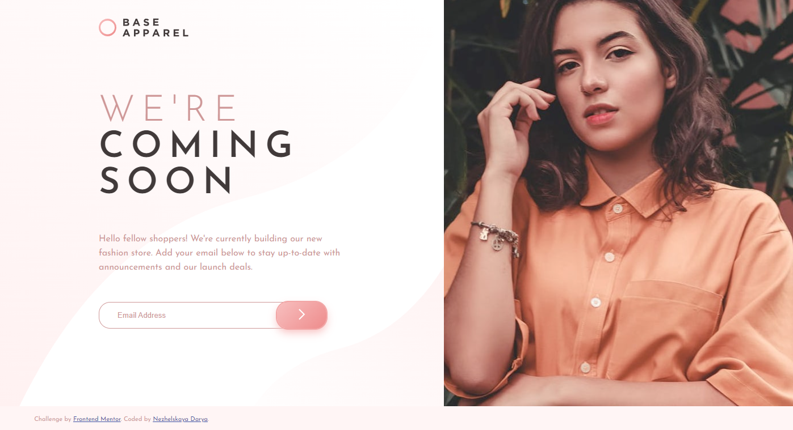
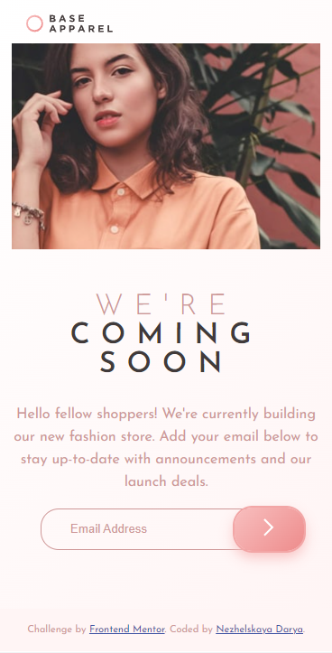

# Frontend Mentor - Base Apparel coming soon page solution

This is a solution to the [Base Apparel coming soon page challenge on Frontend Mentor](https://www.frontendmentor.io/challenges/base-apparel-coming-soon-page-5d46b47f8db8a7063f9331a0). Frontend Mentor challenges help you improve your coding skills by building realistic projects. 

## Table of contents

- [Overview]
  - [The challenge](#Суть челленджа лично для меня состояла в том, чтобы получше разобраться с семантикой HTML, особенно уделить внимание различиям инпутов и их свойствам.)
  - [Screenshot](#  )
- [My process](#Я постаралась учесть те комментарии, которые мне дали пользователи Frontend Mentor на мой прошлый проект. Я старалась уделить больше внимания семантике html)
  - [Built with](#HTMl, CSS, JS)
  - [What I learned](#Мне удалось познакомиться с валидаторомб с некоторыми типами инпутов и их свойствами и т.д.)
  - [Continued development](#Следующий шаг - сделать свой код еще более удобным для других типов устройств.)
- [Author](#Nezhelskaya Darya)